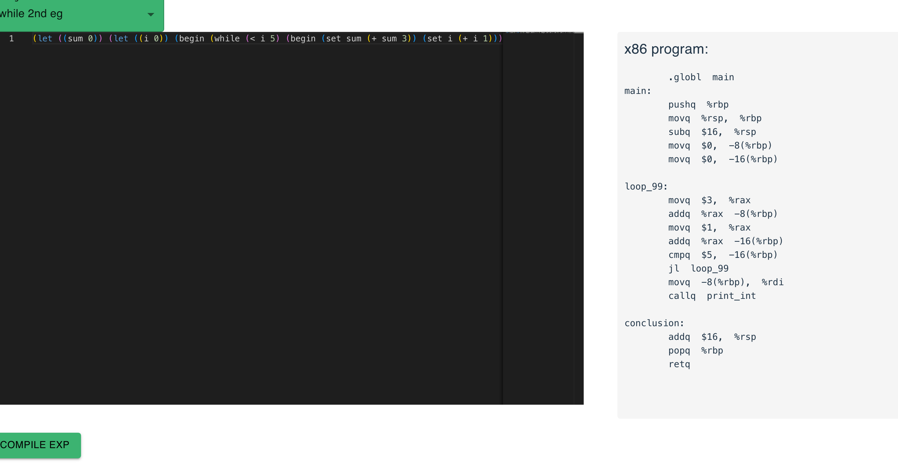

### yacs - Yet another Compiler Service :-)

A compiler web service I quickly wrote to for fun in Go. It compiles core programming features such as `let`, `while loops` and `if` statements. Although this is an S-Expression mini language, its not Scheme.



### Run App with Docker:

```
$ docker-compose up --build
```

### How to call the web service

```
$ cd server
$ make main
```

```python
>>> data = "(let ((sum 0)) (let ((i 0)) (begin (while (< i 5) (begin (set sum (+ sum 3)) (set i (+ i 1)))) sum)))"
>>> url = "http://localhost:1234/api/compiler"
>>> re = requests.post(url, json={"exp": data})
>>> re.json()
{'exp': '\t.globl  main\nmain:\n\tpushq  %rbp\n\tmovq  %rsp,  %rbp\n\tsubq  $16,  %rsp\n\tmovq  $0,  -8(%rbp)\n\tmovq  $0,  -16(%rbp)\n\nloop_99:\n\tmovq  $3,  %rax\n\taddq  %rax  -8(%rbp)\n\tmovq  $1,  %rax\n\taddq  %rax  -16(%rbp)\n\tcmpq  $5,  -16(%rbp)\n\tjl  loop_99\n\tmovq  -8(%rbp),  %rdi\n\tcallq  print_int\n\nconclusion:\n\taddq  $16,  %rsp\n\tpopq  %rbp\n\tretq'}
```
